# Errores conocidos

### Nombre muy largo

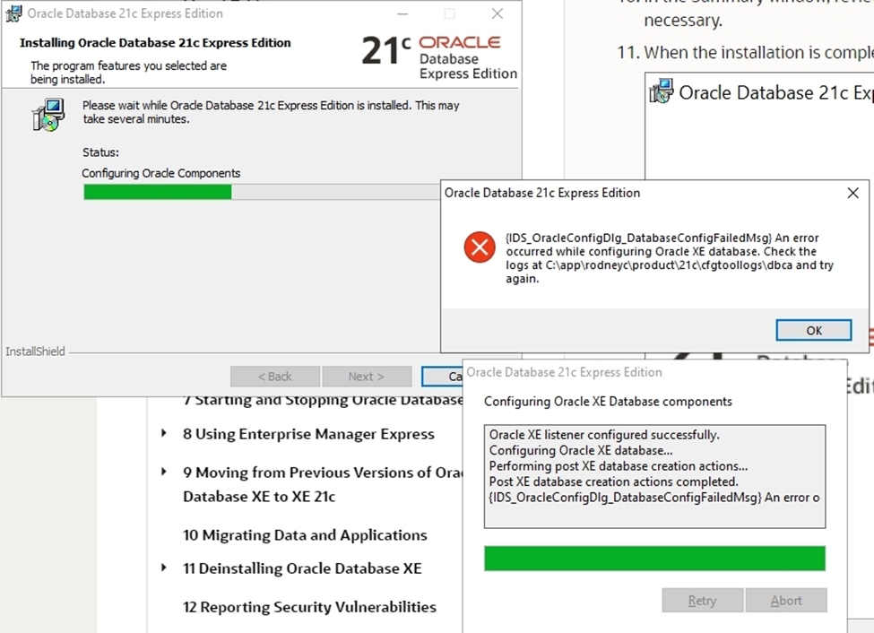

**Solución**: El nombre del equipo sobrepasa los 16 caracteres, se debe renombrar el equipo a un nombre más corto.

### No puede crear DB link

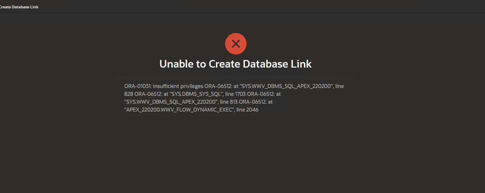

**Solución**: Ejecutamos lo siguiente:

```
C:> sqlplus /nolog
SQL> conn sys/Oracle.1 as sysdba
SQL> alter session set container = XEPDB1;
SQL> GRANT CREATE DATABASE LINK TO [SCHEMA];
```

Sustituir [SCHEMA] por el schema creado en el workspace por ejemplo SCHEMA_DESARROLLO. Para listar los usuarios ejecutar:

```
SQL> SELECT * FROM all_users;
```

### Error: ORA-12638: Credential retrieval failed

**Solución**: Buscar el archivo SQLNET.ORA de la base de datos local y cambiar SQLNET.AUTHENTICATION_SERVICES= (NTS) por SQLNET.AUTHENTICATION_SERVICES= (NONE)

Posibles rutas: "C:\app\product\21c\homes\OraDB21Home1\network\admin\sqlnet.ora"

### Error 503 Service Unavailable

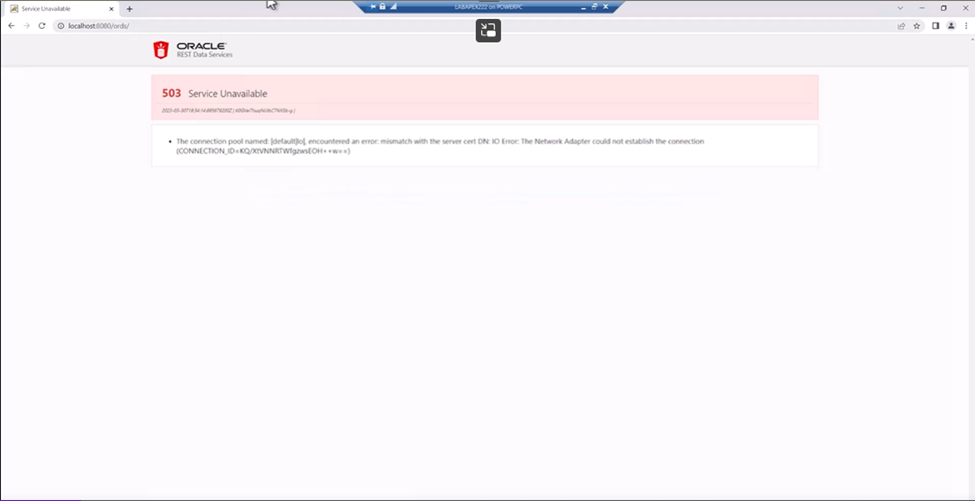

**Solución**: hay que actualizar el archivo tnsnames.ora y el archivo listener.ora en C:/app/Admin/producto/21c/homes/OraDB21Home1/network/admin. Con el nombre correcto de la PC.

Puede que aparezca un error que al final diga Password Expired, esto se soluciona desbloqueando el usuario y reiniciando tomcat.

### Error 503 ORA-01035: ORACLE only available to users with RESTRICTED SESSION privilege

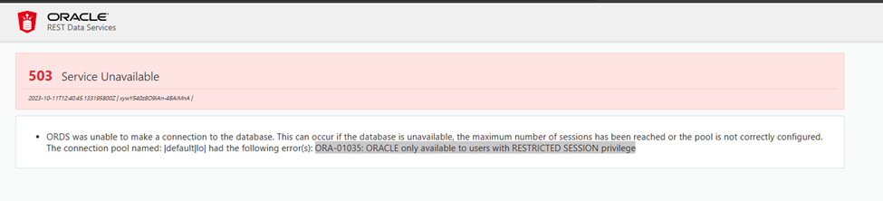

**Solución 1:** en un cmd ejecutar sqlplus:

```
C:\> sqlplus /nolog
SQL> conn sys/Oracle.1 as sysdba
SQL> alter session set container = XEPDB1;
SQL> grant RESTRICTED SESSION to [ESQUEMA]; --sustituir [ESQUEMA] por el esquema creado por ejemplo grant RESTRICTED SESSION to SCHEMA_DESARROLLO;
```

**IMPORTANTE**: luego de ejecutar esto, reiniciar tomcat

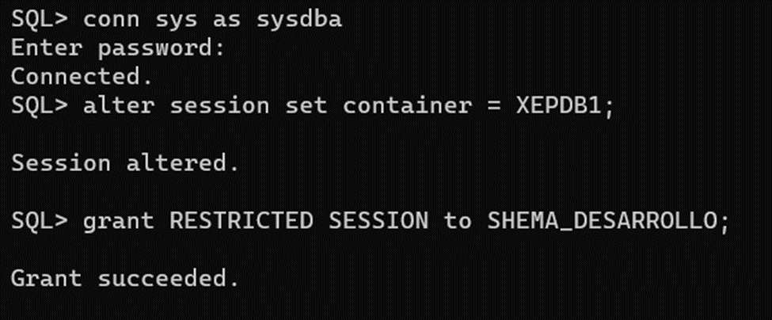

**Solución 2:** Ver si está restringido con el comando show pdbs y ver si dice YES en la columna RESTRICTED.

```
C:\> sqlplus /nolog
SQL> conn sys/Oracle.1 as sysdba
SQL> alter session set container = XEPDB1;
SQL> show pdbs
```

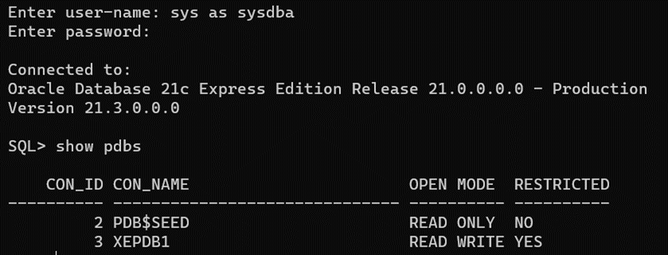

Si dice YES entonces ejecutar:

```
SQL> alter pluggable database <DBNAME> close instances =all;
SQL> alter pluggable database <DBNAME> open read write instances =all;
SQL> alter pluggable database <DBNAME> save state;
```

Donde DBNAME es el nombre del contenedor o Base de datos en nuestro caso XEPDB1 asi que sería (ejecutar 1 por 1):

```
SQL> alter pluggable database XEPDB1 close instances =all;
SQL> alter pluggable database XEPDB1 open read write instances =all;
SQL> alter pluggable database XEPDB1 save state;

```

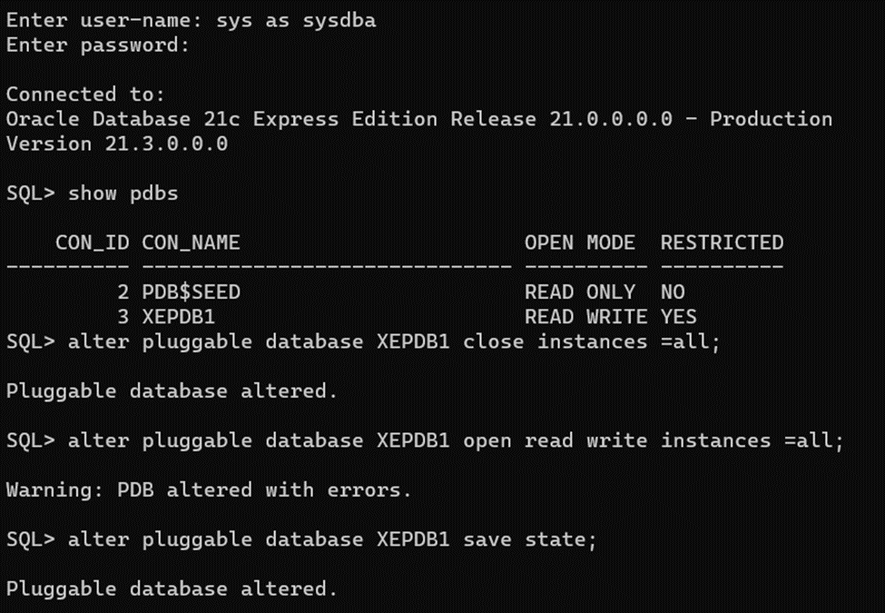

En caso que haya dado error:

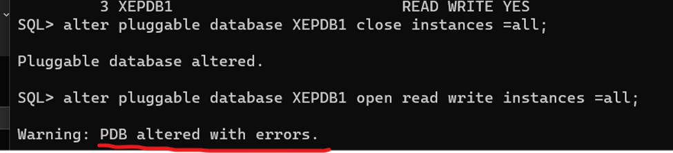

Hay que buscar el error para eso ejecutamos:

```
SQL> alter session set container=CDB$ROOT;
SQL> set linesize 200;
SQL> column name format a10;
SQL> column cause format a10;
SQL> column type format a10;
SQL> column message format a30;
SQL> column action format a30;
```

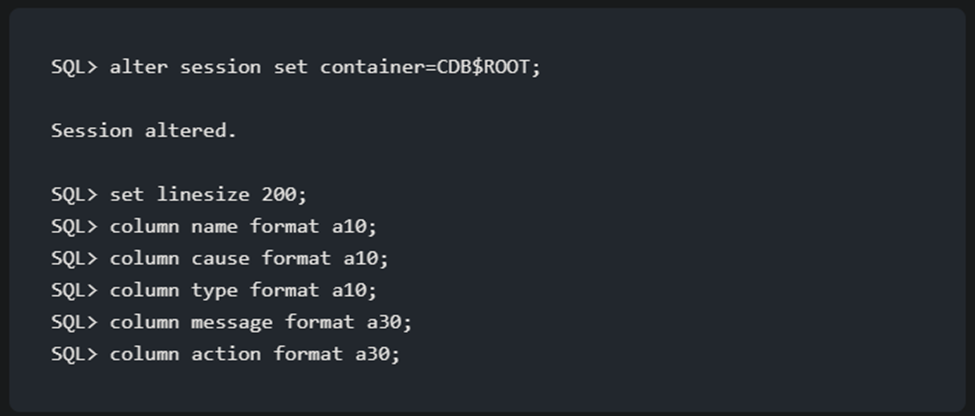

Luego ejecutamos este select para obtener los detalles (OJO: el CON_ID es el que sale cuando ejecutamos show pdbs):

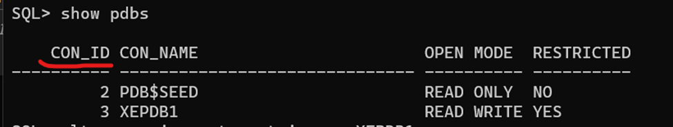

```
SQL> select name, cause, type, message, action from PDB_PLUG_IN_VIOLATIONS where status = 'PENDING' and con_id = 3;
```

Nos da un resultado como el siguiente:

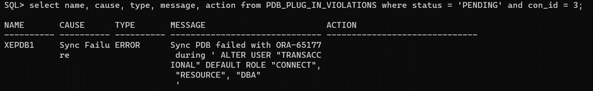

En este caso es que transaccional del contenedor xepdb1 hay que ejecutar el gran restricted sesión to transaccional. Obviamente eso debe ejecutarse en el contenedor.

El erros que daba en este caso es que existían dos usuarios transacciona, uno en el contenedor y otro local la solución fue eliminar el usuario local (el que NO estaba en el contenedor) y luego ejecutar los alters y listo.
