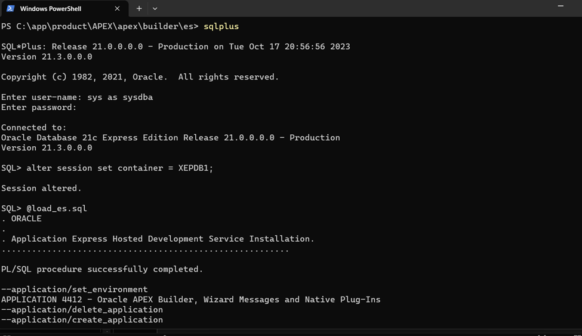

## Instalar español

Ir a la carpeta C:\apex\builder\es y ejecutar:

```
C:\apex\builder\es> sqlplus /nolog
SQL> conn sys/Oracle.1 as sysdba
SQL> alter session set container = XEPDB1;
SQL> @load_es
```

