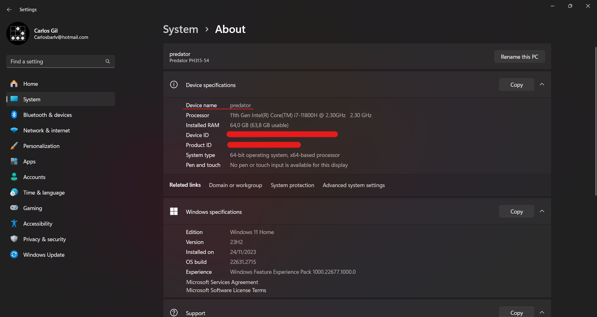
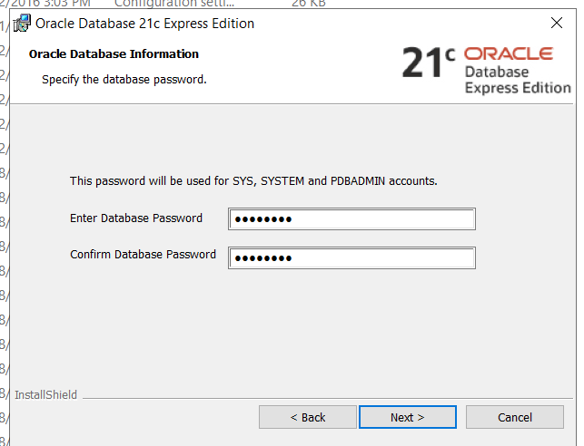
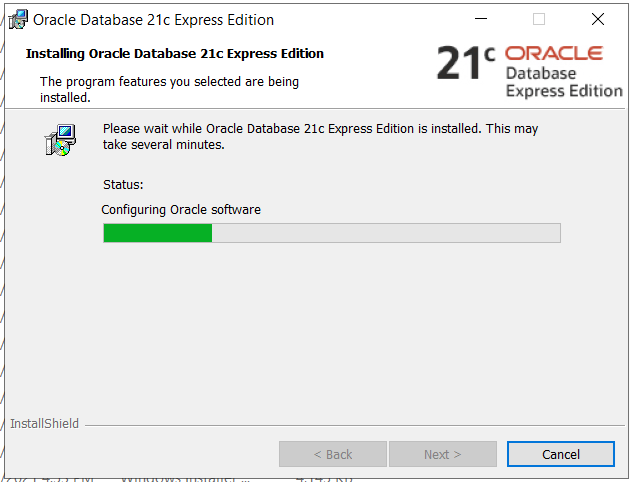
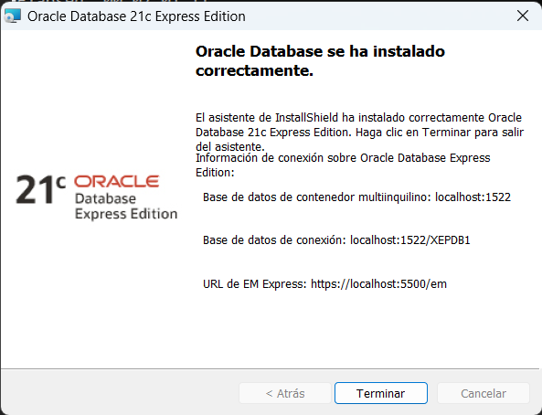

# Guía instalación Oracle Application Express (APEX)

Antes de empezar:

* El nombre el equipo NO debe tener más de 16 caracteres. [Cómo hacerlo](#revisar-el-nombre-del-equipo)
* Recomendable desactivar el antivirus para que no se bloquee la instalación de la base de datos.
* Tener a la mano los siguientes archivos (click en los enlaces para descargarlos):

    1. Archivo de [Oracle APEX](https://download.oracle.com/otn_software/apex/apex-latest.zip)
    2. [ORDS](https://download.oracle.com/otn_software/java/ords/ords-latest.zip)
    3. Base de datos [21c](https://download.oracle.com/otn-pub/otn_software/db-express/OracleXE213_Win64.zip) o superior
    4. [Tomcat 9](https://dlcdn.apache.org/tomcat/tomcat-9/v9.0.83/bin/apache-tomcat-9.0.83.exe)
    5. [JDK 19](https://download.oracle.com/java/19/archive/jdk-19.0.2_windows-x64_bin.exe)
    6. [SQLDeveloper](https://www.oracle.com/database/sqldeveloper/technologies/download/#license-lightbox) 23 (incluye el JDK), puede ser una versión superior

### Revisar el nombre del equipo:

#### Windows 11

En Mi PC, Click derecho > Propiedades > Nombre del dispositivo. Ese es el nombre del dispositivo, en caso de tener más de 16 caracteres, cambiarle el nombre y reiniciar la pc.



#### Windows Server

En Mi PC, Click derecho > Propiedades > Nombre del dispositivo. Ese es el nombre del dispositivo, en caso de tener más de 16 caracteres, cambiarle el nombre y reiniciar la pc.


## Proceso de instalación

1. ### Instalar base de datos Oracle 21c XE. 
Es recomendable utilizar el directorio "C:\app", en la instalación de la base de datos, cambiar el directorio de instalación por el antes mencionado.

Click al botón "Change"


Eliminar el nombre de usuario y solo dejar: "C:\app\product\21c"


Luego de configurada la ruta de instalación click a siguiente (Next).

Utilice "Oracle.1" (sin las comillas) como password de los usuarios SYS, SYSTEM y PDBADMIN, este es el estándard para TODAS las instalaciones.



Luego aparece la ventana de instalación, algo como esto:



Dejar que se instale y luego continuar el paso 2 (puede que tome varios minutos 15-30 min). Al terminar aparece una ventana como esta (tomar en cuenta el puerto en el que se instaló, lo normal es el 1521 pero puede que sea otro como en este caso que fue el 1522):



2. ### Crear directorios

En la ruta "C:\app\product" crear las siguientes carpetas:

    - \apex
    - \ordssetup
    - \ords\config (una carpeta llamada ords y dentro de esa una llamada config)
    - sqldeveloper
    - tomcat9ords

Estas carpetas son para llevar mejor el control de las cosas que instalaremos. Y para poder evitar errores de administración de windows por ponerlos en rutas protegidas.

3. ### Descromprimir apex

Dentro de la carpeta apex que creamos en "C:\app\product" movemos el archivo de apex que descargamos y lo descomprimimos. Quedando más o menos así:


Se descomprime dos carpetas, entramos en la que se llama apex.

Abrimos un CMD dentro de esa carpeta (puedes hacerlo dejando la tecla Shift presionada y dando click derecho en cualquier espacio en blanco, luego click en abrir una terminal aquí).


Luego de abierta la terminal ejecutamos:

```
C:\app\product\apex\apex> sqlplus /nolog
```


Nos conectamos con el usuario sys (sustituir Oracle.1 por el password que se colocó en el paso de instalación de la base de datos, en caso que no sea el mismo que se pone más abajo):

```
SQL> conn sys/Oracle.1 as sysdba
```


Cambiarse al contenedor de apex

```
SQL> alter session set container = XEPDB1;
```


## Crear un nuevo table space:

NOTA: este paso lo recomiendan algunas personas, pero en la doucmentación oficial de APEX no nos indican que sea necesario crearlo, pero para evitar que se llene mejor crear uno independiente. Si no quieres crearlo puedes saltar a [Crear en sysaux](#crear-en-sysaux)

```
SQL> create tablespace APEX datafile 'C:\app\product\21c\oradata\XE\XEPDB1\apex_data01.dbf' size 1G extent management local autoallocate segment space management auto;
```


Ejecutamos la instalación de apex

```
SQL> @apexins apex apex temp /i/;
```

## Crear en sysaux

NOTA: Ejecutar esto SOLO si NO creaste el otro tablespace mencinado en [Crear un nuevo table space](#crear-un-nuevo-table-space)

```
SQL> @apexins sysaux sysaux temp /i/;
```
Se empezará a instalar, tarda entre 20-40 min


Cuando termina ingresamos: exit para salir del CMD, debido a que la terminal ahora cambia a SYS en vez de SQL


```
SYS> exit
```

Cambiar el password del usuario ADMIN de apex;

```
SQL> @apxchpwd;
```

Dejamos ADMIN como nombre de usuario (Presionamos ENTER)


Colocamos el email del admin (Puede ser cualquiera)


Colocamos la contraseña del administrador (Que no se olvide, preferiblamente Oracle.1, debe tener numeros, letras y caracteres especiales)


Luego de colocada la clave sale esto:


### Desbloquer la cuenta del usuario apex_public_user

Esta cuenta se crea con una clave aleatoria y también está bloqueada.

Desbloqueamos el usuario y le cambiamos el password con:

```
SYS> alter user APEX_PUBLIC_USER IDENTIFIED BY "Oracle.1" account unlock;
```

NOTA: este usuario se encuentra en un profile que caduca cada 180 días.

En caso que quisieramos que NO caduque, debemos crear un nuevo profile y asignar el usuario a ese nuevo profile.

### Crear un profile

Ejecutamos lo siguiente:

```
SQL> create profile APEX_USER_PROFILE limit PASSWORD_LIFE_TIME UNLIMITED;
```

Luego para asignarle al usuario ese profile ejecutamos:

```
SQL> alter user APEX_PUBLIC_USER profile APEX_USER_PROFILE;
```

Deshabilitar el Oracle XMLDB protocol server:

```
SQL> exec dbms_xdb.sethttpport(0);
```

Permitir la conexión al esquema de apex (sustituir APEX_230200 por la versión de apex que se esté instalando, por ejemplo si es apex23.2 entonces sería APEX_230200):

```
SQL> BEGIN
        DBMS_NETWORK_ACL_ADMIN.APPEND_HOST_ACE(
            host    => '*',
            ace     => xs$ace_type(privilege_list => xs$name_list('connect'),
            principal_name => 'APEX_230200',
            principal_type => xs_acl.ptype_db)
        );
     END;
     /
```

Configurar el rest

```
SQL> @apex_rest_config
```

Pedirá un password pondremos Oracle.1 o la clave que queramos en los dos casos, tanto para APEX_LISTENER como para APEX_REST_PUBLIC_USER.


### Instalar el idioma español

```
SQL>@C:\app\product\apex\apex\builder\es\load_es.sql
```

### Instalar el JDK

Ejecutamos el archivo JDK que descargamos y simplemente siguiente, siguiente.

### Instalar y configurar el ORDS

Descomprimimos el archivo **ords-latest.zip** en la carpeta **ords**

Dentro debe existir una carpeta **config** (la creamos en pasos anteriores, sino existe entonces crearla)

Esto porque al momento de configurar el ORDS los archivos los coloca de manera temporal en memoria y no queremos eso sino, tener los archivos en un lugar específico.

En la carpeta de apex vamos a copiar la carpeta **images** y vamos a pegarla dentro de la carpeta **ords**


Abrimos un CMD en la carpeta ords\bin y ejecutamos SQLPLUS:

```
C:\app\product\ords\bin> sqlplus /nolog
```

Nos conectamos con sys:

```
SQL> conn sys/Oracle.1 as sysdba
```

Nos movemos al container

```
SQL> alter session set container = XEPDB1;
```

Creamos un nuevo tablespace para los recursos del ORDS

```
SQL> create tablespace ORDS datafile 'C:\app\product\21c\oradata\XE\XEPDB1\ords_data01.dbf' size 1G extent management local autoallocate segment space management auto;
```

NOTA: en la imagen la clave es oracle, cambiarla por la que se usó al momento de instalar la base de datos.


Salimos del SQL con el comando exit:

```
SQL> exit
```

Confirmamos que estamos en C:\app\product\ords\bin> y ejecutamos:

```
C:\app\product\ords\bin> .\ords.exe --config C:\app\product\ords\config install
```

Nos aparece una ventana como la siguiente, presionamos enter para indicar que es el 2:

La opción por defecto es el valor que está entre las llaves cuadradas, en el caso siguiente el valor es 2 [2] por lo tanto si presiono ENTER el valor que va a tomar es el 2.


En la siguiente también le damos ENTER para que tome el valor 1:


Seguimos dando enter hasta llegar a Enter the database service name, en ese caso ponemos XEPDB1:


En **Enter the administrator username** poner SYS y en el password ponerle Oracle.1 (debe ser el mismo que se le puso al momento de instalar la DB de lo contrario se produce un error como en la imagen):


Lo siguiente es colocar el table space que acabamos de crear (ORDS) y en el TEMP le dejamos el mismo.


En los siguientes le damos 1 y en el de start ORDS in standalone le damos Skip, ya que el standalone es para usarlo con el CMD abierto (como un servicio)


Se ejecuta un proceso como de 1 min...

### Instalar tomcat

Ejecutamos el archivo descargado de tomcat:

Presionamos Next


Marcamos el **Host Manager**


Cambiamos el puerto por defecto por el 9090, agregamos el usuario admin y ponemos como clave Oracle.1


Siguiente hasta llegar a la parte del Destination Folder y cambiarlo por la carpeta de tomcat que creamos al principio (tomcat9ords, crearla si no existe en la misma ruta de la imagen)


**OPCIONAL:** Después de completar la instalación, ir al firewall para abrir el puerto 9090 para tener acceso desde otras PC's.

### Desplegar APEX en tomcat 9

Copiar la carpeta images que esta en la carpeta de apex y pegarla en el tomcat9 que creamos en la carpeta webapps(C:\app\product\tomcat9ords\webapps)

Luego de pagada renombrarla a **i** (una letra i)

Vamos a la carpeta de ORDS de nuevo, y ejecutamos el siguiente comando:

```
C:\app\product\ords> java -jar ords.war --config C:\app\product\ords\config war c:\app\product\tomcat9ords\webapps\ords.war
```


Luego de esto hacer la prueba en http://localhost:9090/ords

Debe salir una pantalla mas o menos como la siguiente:


Le damos a la opción del centro para ir a Oracle APEX

Nos aparece:


### Crear un nuevo esquema

Nos logueamos con el usuario admin que creamos y en el workspace ponemos INTERNAL.


Damos click a crear workspace y llenamos los campos:


SCHEMA NAME: SCHEMA_DESARROLLO

SCHEMA PASSWORD: Oracle.1

SPACE QUOTA (MB)(VALUE REQUIRED): 10000

Los siguientes son datos del administrador del workspace


Una vez completado todo sale la siguiente ventana:

