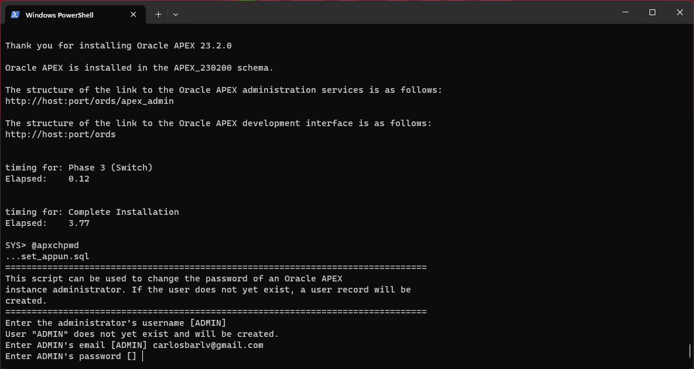

### Actualizar APEX

Requisitos:

1. Descargar la última versión de [APEX](https://download.oracle.com/otn_software/apex/apex-latest.zip).

2.	Crear una carpeta en C:/app/producto/ llamada ápex y descomprimir el archivo descargado. (si la carpeta ya existe renombrarla por ejemplo apex19 para saber que esa es la versión vieja)
3.	Abrir un CMD en la carpeta creada y entrar a la carpeta de ápex. Tiene que ser en esta carpeta:


4.	Una vez estemos en la carpeta ejecutamos los siguientes scripts (es lo mismo que cuando instalamos APEX):

```
C:\> sqlplus /nolog
SQL> conn sys/Oracle.1 as sysdba
SQL> @apexins [tableSpace] [tableSpace] temp /i/;
```

Sustituis [tableSpace] por el table space correcto (puede que sea sysaux o apex [si se creo ese tablespace al momento de instalar apex por primera vez])

Esto empieza el proceso de actualizacion de apex, dejamos terminar y cuando termina ejecutamos:

```
SQL> @apxchpwd
```

Presionamos Enter para dejar el nombre de usuario como ADMIN



En caso de que pida EMAIL le dejamos también el mismo

El password le ponemos el mismo que le pusimos cuando instalamos por primera vez (Oracle.1)

Desbloquear el usuario APEX_PUBLIC_USER, esto porque se bloquea cuando actualizamos, ejecutando:

```
SQL> ALTER USER APEX_PUBIC_USER IDENTIFIED BY “Oracle.1” ACCOUNT UNLOCK;
```

Ejecutamos:

```
SQL> @apex_rest_config
```

Va a pedir un password para los usuarios APEX_LISTENER y APEX_REST_PUBLIC_USER, ponemos Oracle.1 en ambos casos

Reiniciar TOMCAT

Copiar la carpeta images que esta en la carpeta de ápex (la que descargamos nueva) y pegarla en webapps del tomcat (puede que sea en C:\app\product\tomcat9ords\webapps)

Eliminar la carpeta “i” que ya existe (o puede renombrarla a i19 por ejemplo), y luego renombrar la carpeta images que acabamos de pasar renombrarla a “i”

